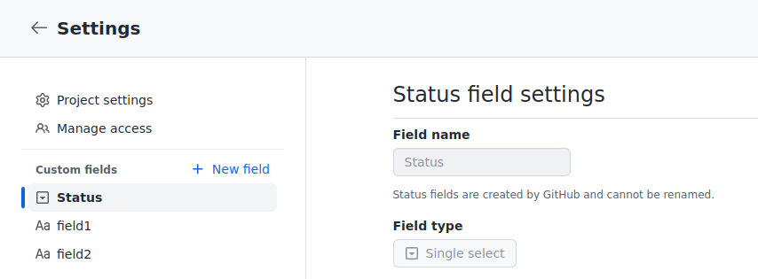

# ghh - GitHub Helper tool

## `create-project-issue`

Create project issue creates a new draft issue in a GitHub
project board. Metadata can be added in the form of fields and
users can be assigned.

The command takes two inputs: a path to an issue body (markdown or plain text)
and a path to a JSON document of metadata. The metadata file looks like this:

```json
{
    "organization": "<your org>",
    "projectNumber": 42,
    "issueTitle": "<your issue title>",
    "assignees": [
        "<login>"
    ],
    "fields": {
        "Status": "<board column>",
        "field1": "value1",
        "field2": "value2"
    }
}
```

The project number is part of the URL of your target project board.


For boards with columns, the column is also a field. You can find the
field name and the possible values in your project settings.


